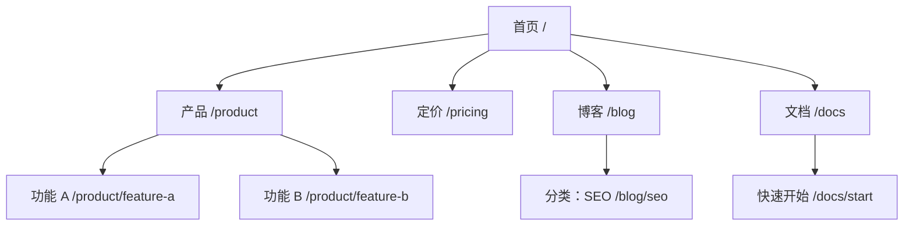
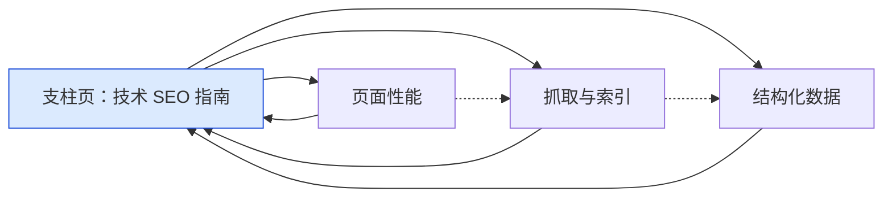
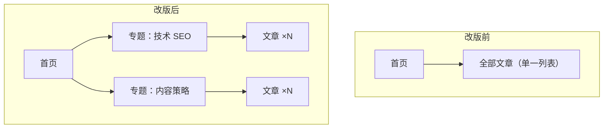

# 用 Mermaid 画站点结构与内链

用途：在方案里用 Mermaid 图说明站点层级、专题集群、内链流向和改版前后对比。Mermaid 能直接在很多 Markdown 渲染器中显示，也便于和文字方案一起版本管理。

## 写法约定

- 节点 ID 用简短英文（`home`、`blog`），显示文字放在方括号里，含特殊字符时加引号：`home["首页 /"]`。
- 需要展示 URL 时写在显示文字里：`pricing["定价 /pricing"]`。
- 用 `classDef` 标颜色，并在图下方写图例；不要只靠颜色区分含义。
- 一张图控制在二三十个节点以内，超过就拆成总览图和分区图。
- 实线表示导航或层级关系，虚线表示正文中的上下文链接。

## 示例一：站点层级

## 示例二：专题集群与内链

图例：蓝色为支柱页；实线为支柱页与子页的双向链接，虚线为子页之间的上下文链接。

## 示例三：改版前后对比

## 配套文字

每张图下面写清：图表达了什么、和现状的差异、涉及哪些 URL 变更（需要重定向的列表单独给出，做法见 [http-status-codes.md](http-status-codes.md)）。结构原则见 [link-architecture-patterns.md](link-architecture-patterns.md) 和 [site-type-templates.md](site-type-templates.md)。

## 来源

本文由 EveryInfra 自行编写，只保留要点，未复制原文。

- 思路参考：[coreyhaines31/marketingskills · skills/site-architecture/references/mermaid-templates.md](https://github.com/coreyhaines31/marketingskills/blob/v1.10.0/skills/site-architecture/references/mermaid-templates.md)（MIT）
- 一手资料：[Mermaid 文档](https://mermaid.js.org/intro/)
